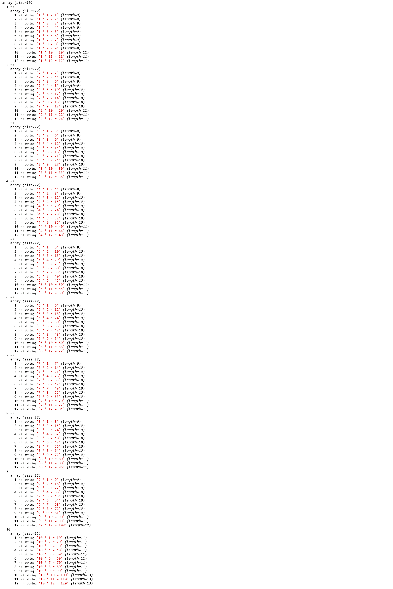
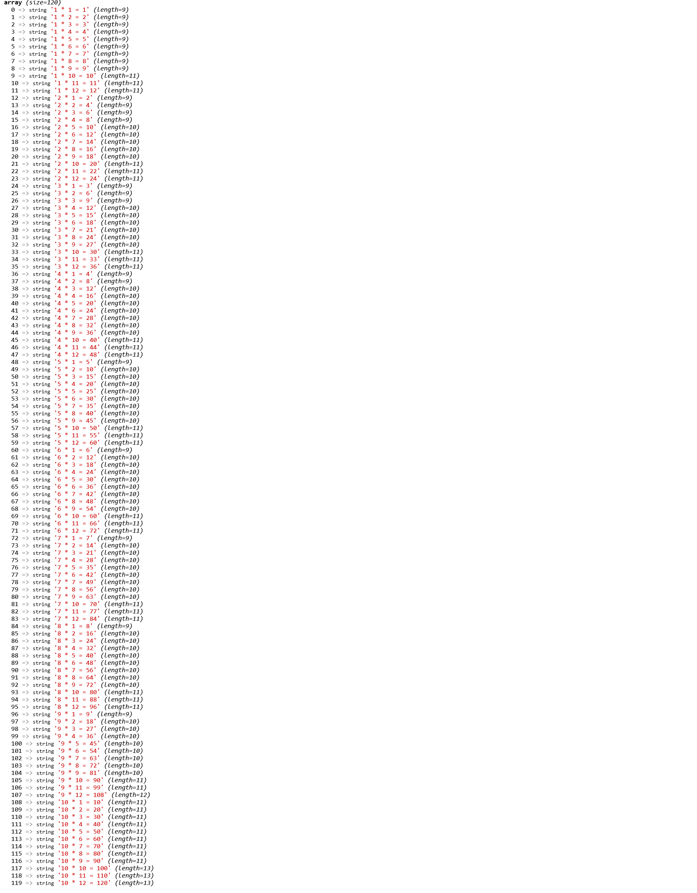

# Exercice 5 : tableaux multidimensionnels

1. Créez une fonction qui prend en paramètres 3 entiers, deux nombres multiplicandes (nombre par lequel on multiplie) qui sont des intervalles pour une table de multiplication et le dernier paramètre, le multiplicateur maximum.
Le résultat de toutes les tables est retourné dans un tableau multidimensionnel.
Exemple de la signature `function tabMultiplication(int $maxNumber, int $endTable, int $startTable) : array {}`
Exemple de la structure des résultats pour l'appel de la fonction avec les paramètres suivants `tabMultiplication(10, 12, 1);` qui produit le résultat ci-dessous.

2. Créez une autre fonction qui prend le résultat du tableau multidimensionnel de la fonction précédente et retourne un tableau associatif numérique à une dimension contenant uniquement les valeurs.
Par exemple `function multiToSolo($results) {}` retourne 

