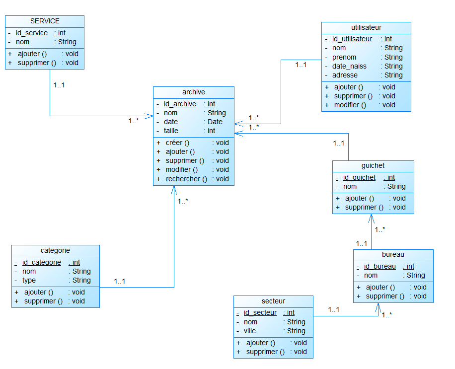

# Exercice 6

---

## Sources du diagramme UML

- [Diagramme de classe de developpez.net](https://www.developpez.net/forums/d1878825/general-developpement/alm/modelisation/uml/diagramme-classe-base-donnees/)

---

## Enoncé

1. Reprenez les exercices 1 à 5 et regroupez les instructions dans des classes.
2. A partir du [diagramme de classes UML](http://uml.free.fr/cours/i-p14.html), ci-après, créez les classes correspondantes en PHP.

