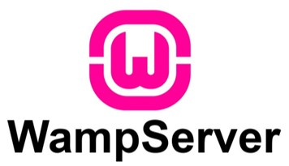
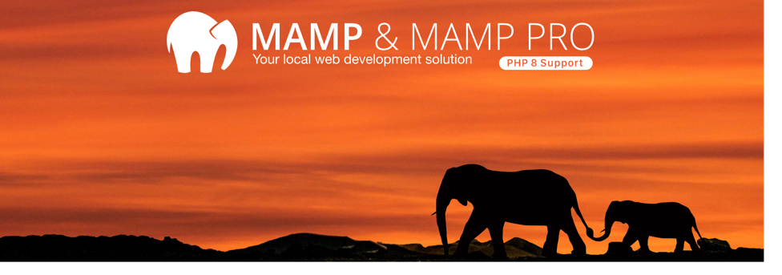
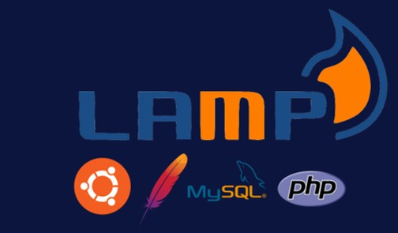
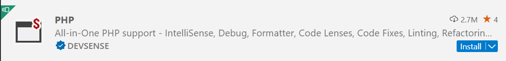

# Documentation et Installations

---

## Documentations

- [Site officiel php.net](https://www.php.net/)
- [Coding game PHP]()

---

## Installation des logiciels pour avoir Apache, PHP et MySQL (et MariaDB)

### WAMP

Pour les utilisateurs de Windows
- Installez l’environnement de développement de PHP pour Windows depuis WampServer en 64 bits ou 32 bits selon la configuration de votre machine

#### Caractéristiques

- ***Apache 2.4.54.2*** : serveur Web
- ***PHP 7.4.33 , 8.0.26, 8.1.13 et 8.2.0*** : langage de programmation accompagné de toutes les fonctionnalités nécessaires au développement Web
- ***MySQL 5.7.40 et 8.0.31*** : serveur de base de données relationnelles (SGBDR)
- ***MariaDB 10.9.4 et 10.10.2*** : idem que MYSQL
- ***PHPMyAdmin 5.20*** : site web permettant d’administrer et de manipuler les bases de données disponibles en local

---

### MAMP

Environnement de développement adapté pour les utilisateurs de MacOS à installer depuis [MAMP.info](https://mamp.info)
On retrouve les mêmes technologies que sur Wamp

---

### LAMP

Pour LAMP, il faut installer les paquets individuellement selon sa distribution Linux (Ubuntu, CentOs, Debian, etc.)
Pour l’installation suivre le [tutoriel d’OVH](https://help.ovhcloud.com/csm/fr-dedicated-servers-setup-lamp-debian-ubuntu?id=kb_article_view&sysparm_article=KB0043615)

---

## Installation de composer (gestionnaire des paquets pour PHP, équivalent de npm côté JS)

---

## Extension Visual Studio Code pour PHP

---

## 3 façons d'exécuter vos projets PHP

### Depuis le dossier www de WAMP ou l'équivalent pour les autres environnements MAMP et LAMP

Créez un dossier à partir du dossier ***www*** de *Wamp*
Accéder à l’url `http://localhost/nomDuDossier`

La procédure est similaire avec les autres environnements de développement *MAMP*, *XAMP*, etc.

`index.php` est le point d’entrée d’un programme PHP. Les serveurs web sont configurés pour lire dans un dossier ce fichier en premier.

### Depuis un virtual Host

Créez un dossier n’importe où sur votre machine
Créez un *virtualHost* qui permet de faire une correspondre entre un nom de domaine en local avec le chemin absolu vers ce dossier
Accédez au nom de domaine depuis le navigateur pour accéder au programme

### Depuis le CLI (Command Line Interface) de PHP

Depuis un terminal, à la racine de votre projet, exécutez à la commande suivante : `php -S http://localhost:8080`.

PS : vous pouvez renseigner le port que vous voulez sauf les ports déjà réservés par d'autres applications.